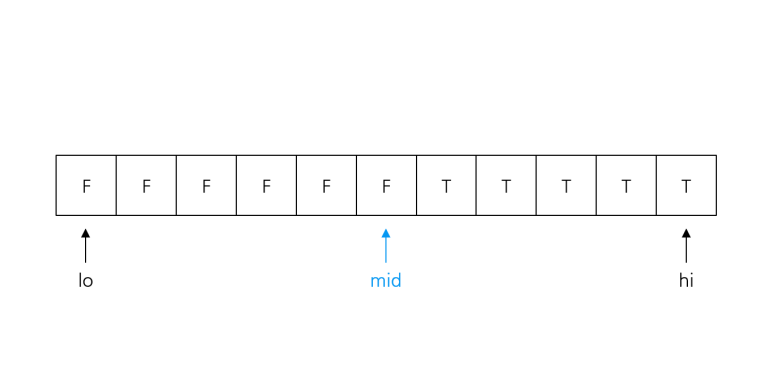
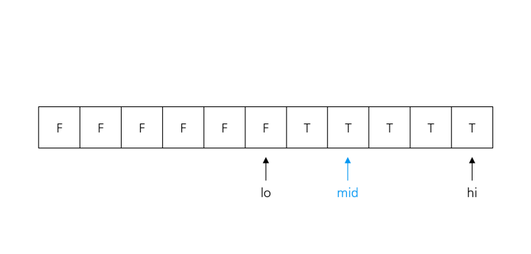
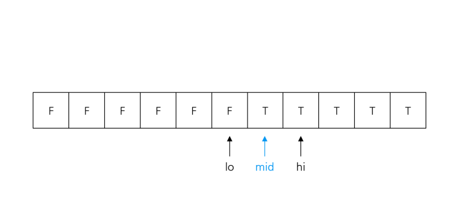
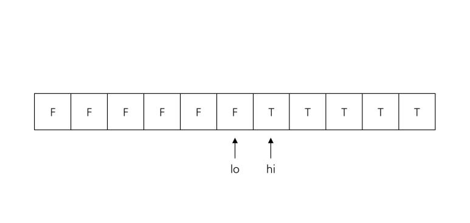

# Binary Search - 이분탐색 🐿️💚


### 연습 문제

- Binary Search : https://www.acmicpc.net/workbook/view/9764

- lower_bound, upper_bound : https://www.acmicpc.net/workbook/view/9264

<br>

## 1. 시간복잡도

- 이분탐색의 시간 복잡도는 O(logN) 이다.
- 여기서 log는 log₂이다.
- 단계마다 탐색 범위를 반으로 나누는 것과 같다.

`※ 주의사항 : 이분 탐색은 off-by-one error 가 발생하기 쉬워서 헷갈려요!`

    → 탈출 조건으로 lo <= hi, lo < hi, lo + 1 < hi 중 어느 걸 선택해야 할 지,
     정답이 lo인지 hi인지 (lo + hi) / 2인지 모르겠고,
     심지어 while문이 끝나지 않아서 '시간초과'가 뜨기도 합니다.

`1. 헷갈리지 않게 구현하는 방법 `

`2. 이분탐색의 대표적 응용인 lower_bound, upper_bound`

### 잊지 말아야할 Computer Science 문제 해결 규칙

1. 사용된 알고리즘이 적절한가? (문제를 해결할 수 있는가?)
2. 효율적으로 동작하는가?

</br>

## 2. 세 줄 요약

    1. [lo, hi]가 Check(lo) != Check(hi)가 되도록 구간을 설정

    2. while (lo + 1 < hi)동안 mid = (lo + hi) / 2에서 Check(mid) = Check(lo)라면 lo = mid, 아니라면 hi = mid

    3. 구한 경계에서 답이 lo인지 hi인지 생각해보고 출력

    (1에서 경계는 항상 [lo, hi] 내에 존재하고,
     2에서 Check(lo), Check(hi)는 변하지 않으며,
     3에서 lo + 1 >= hi 이고, lo < mid < hi 에서 lo < hi 이므로 lo == hi 를 만족함)

## 3 .이분 탐색이란?

    결정문제(Decision Problem)의 답이 이분적일 때 사용할 수 있는 탐색기법

- `결정 문제`란 `답이 YES or NO인 문제` 를 의미함.

- 이분탐색의 문제에서는 보통 1개의 parameter를 가짐.

### 예시

`1~50 까지 오름차순 정렬된 카드 더미에서 28번 카드를 찾는 문제`를 예시로 이분 탐색을 알아보겠습니다. 편의상 첫 번째 카드부터 `i번째 카드는 v[i]`, `28은 var`로 표기하겠습니다.

이때 결정 문제를 "v[i] >= val 인가?" 로 잡으면 결정 문제의 답은 i가 증가함에 따라 F, F, F, ..., T, T, ...T와 같이 분포합니다. 우리가 찾고자 하는 값은 처음으로 v[i] >= val 지점, 즉 처음 결정 문제가 True가 되는 i값입니다.

이렇게 결정 문제의 parameter(i) 에 대해 결정 문제의 답이 두 구간으로 나뉘는 것을 `이분적이다` 라고 하며,

이런 경우 이분 탐색을 사용해 결정 문제의 답이 달라지는 경계를 찾을 수 있습니다.

### 이분 탐색의 아이디어

    경계를 포함하는 구간[lo, hi]를 잡은 뒤 구간의 길이를 절반씩 줄여나가며 lo, hi이 경계 지점에 위치하도록 하는 것

이분탐색이 끝난 뒤에는 lo의 다음 칸은 hi(즉, lo + 1 == hi)이며 Check(lo) != Check(hi)입니다. 이때 Check(x)는 결정 문제의 parameter가 x일 때 결정 문제의 답을 의미합니다.

위 예시에서 [1, 50] → [25, 50] → ... → [27, 28]로 lo, hi를 줄여나간 뒤 `hi = 28` 를 찾아주면 됩니다. 이분 탐색은 `구간의 범위가 클 때 특히 효과적`입니다. 만약 `카드가 100만장`이라고 하면, `2^20 >= 1,000,000`이기 때문에 `최대 20번의 연산`으로 원하는 카드를 찾을 수 있습니다.

## 4. 구현 방법 - `1. 헷갈리지 않게 구현하는 방법 `

1.  Check(lo) != Check(hi) 가 되도록 lo, hi의 초깃값을 잘 설정

2.  `lo + 1 < hi`인 동안 `mid = (lo + hi)/2` 를 구하기

3.  Check(`lo`) == Check(`mid`)라면 `lo = mid`를,
4.  Check(`hi`) == Check(`mid`)라면 `hi = mid`를 해주면 됨

    - 우선 초기 상태의 lo, hi가 Check(lo) != Check(hi)이기 때문에 결정 문제의 답이 바뀌는 경계는 [lo, hi] 내에 있음이 보장됨

5.  lo + 1 < hi 인 동안 [lo, hi]를 [lo, mid] 또는 [mid, hi]로 줄여 나가는데, 이 경우 Check(lo), Check(hi)는 바뀌지 않음

        ∵ Check(lo) == Check(mid)라면 `lo = mid`를, Check(hi) == Check(mid)라면 `hi = mid`를 하기 때문

6.  또한 lo + 1 < hi 이기 때문에 lo와 hi 사이에는 무조건 한 개 이상의 칸이 있으며, mid 는 항상 lo < mid < hi 를 만족

        ∴ 구간의 길이 : 매번 절반씩 줄어들며, 언젠간 lo + 1 == hi가 되어서 반복문 탈출

(`반복문을 탈출했다면 lo + 1 >= hi` 인데 `lo < mid < hi인 mid를 대입`하기 때문에 `lo < hi` 이고, `두 조건을 만족`하는 lo, hi는 `lo + 1 == hi인 경우 밖에 없음`)

### → 🐈 이분 탐색이 끝나면 lo, hi는 결정 문제의 답이 바뀌는 경계에 위치함

### → 🐈 만약 결정 문제 답의 분포가 F~T인데 정답이 `가장 큰 F라면 lo`를, `가장 작은 T라면 hi`를 출력해주면 됨.

<br>

## 5. 시각화된 자료

### 1. 경계를 포함하도록, 즉 Check(lo) != Check(hi)가 되도록 [lo, hi]를 잡음



2. Check(lo) == mid라면 lo = mid, 아니라면 hi = mid를 반복



3. lo + 1 == hi가 되면 탈출, lo, hi는 경계에 위치



<br>

## 6. `2. 이분탐색의 대표적 응용인 lower_bound, upper_bound`

### 이분탐색이 사용되는 대표적인 예시

- 정렬된 배열에서 특정 값 이상 또는 초과인 원소가 등장하는 처음 위치를 찾는 문제

이는 `cpp를 기준`으로 `algorithm 헤더`에 `std::lower_bound`, `std::upper_bound`라는 함수로 구현되어 있음

```C++
#include <iostream>
#include <algorithm>
#include <vector>

int main() {
    std::vector<int> vec = {1, 2, 4, 4, 5, 6, 7};

    // lower_bound 사용 예시
    auto lower = std::lower_bound(vec.begin(), vec.end(), 4);
    std::cout << "Lower Bound: " << std::distance(vec.begin(), lower) << std::endl;

    // upper_bound 사용 예시
    auto upper = std::upper_bound(vec.begin(), vec.end(), 4);
    std::cout << "Upper Bound: " << std::distance(vec.begin(), upper) << std::endl;

    return 0;
}
```

<br>

1.  lower_bound

        v[i-1] < k <= v[i]인 i를 찾아주는 함수

        v[i] >= k 인 i의 최솟값을 반환

        만약, v의 모든 원소가 k보다 '작다면' v의 마지막 다음 칸의 위치 반환

2.  upper_bound

        v[i-1] <= k < v[i]인 i를 찾아주는 함수

        v[i] > k인 i의 최솟값을 반환

        만약, v의 모든 원소가 k보다 '작거나 같다면' v의 마지막 다음 칸의 위치 반환

### lower_bound, upper_bound 구현 (Python.ver)

```python
def lower_bound(arr, x):
    lo, hi = -1, len(arr)
    while lo + 1 < hi:
        mid = (lo + hi) // 2
        if not (arr[mid] >= x):
            lo = mid
        else:
            hi = mid
    return hi

def upper_bound(arr, x):
    lo, hi = -1, len(arr)
    while lo + 1 < hi:
        mid = (lo + hi) // 2
        if not (arr[mid] > x):
            lo = mid
        else:
            hi = mid
    return hi

v = [1, 2, 3, 3, 4]
print(lower_bound(v, 3))  # 2
print(upper_bound(v, 3))  # 4
print(upper_bound(v, 3) - lower_bound(v, 3))  # 2
```

## P.S. Python 이진 탐색 라이브러리

`bisect` : 이진 탐색 라이브러리(모듈) 지원

`정렬된 리스트` 에서 `값이 특정 범위에 속하는 원소의 개수` 를 구할 때 사용하면 효율적

- bisect_left(a, x) --> 정렬된 순서를 유지하면서 리스트 a에 데이터 x를 삽입할 가장 왼쪽 index를 찾는 method

- bisect_right(a, x) --> 정렬된 순서를 유지하도록 리스트 a에 데이터 x를 삽입할 가장 오른쪽 인덱스를 찾는 메소드

```python
from bisect import bisect_left, bisect_right
a = [1, 2, 4, 4, 8]
x = 4

print(bisect_left(a, x))
>>> 2
# 리스트 a에 4를 삽입할 가장 왼쪽 인덱스 = 2

print(bisect_right(a, x))
>>> 4
# 리스트 a에 4를 삽입할 가장 오른쪽 인덱스 = 4
```
